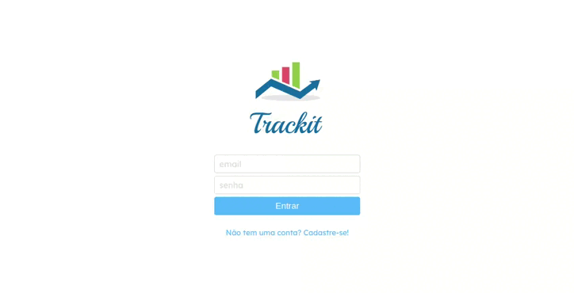
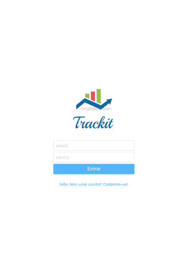
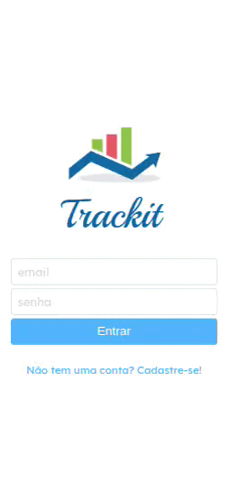

<p align="center"></p>

# <p align="center">Trackit</p>

#### <p align="center">App de acompanhamentos de hábitos</p>

<p align="center">
   

   

   

   

   
</p>

$~$

***

### :clipboard: Descrição

Este projeto é um aplicativo web desenvolvido com React que oferece uma forma eficiente de acompanhar os hábitos diários. Com uma interface intuitiva, os usuários  podem criar uma conta e começar a registrar seus hábitos. É possível adicionar, excluir ou visualizar todos os seus hábitos registrados. Além disso, os usuários podem marcar seus hábitos como concluídos ou não concluídos e ver seu progresso diário. Um calendário interativo está disponível para que se possa acompanhar quais dias eles completaram todos os hábitos.

#### 📊 [Acesse aqui](https://trackit-gabrielatiago.vercel.app/)

***

### :rocket: Rodando o projeto localmente

Este projeto foi iniciado com [Create React App](https://github.com/facebook/create-react-app), portanto, certifique-se de ter a última versão estável do [Node.js](https://nodejs.org/en/download) e [npm](https://www.npmjs.com/) rodando localmente.

Primeiro de tudo, clone este projeto ou faça o download do ZIP.

Para realizar o clone, no terminal de sua máquina, utilize o [git](https://git-scm.com/) e insira o seguinte comando:

```bash
    git clone git@github.com:GabrielaTiago/Trackit.git
```

Entre na pasta do projeto

```bash
    cd Trackit
```

Execute o seguinte comando para instalar as dependências.

```bash
    npm install
```

Depois de instalar as dependências, execute o comando para iniciar a aplicação.

```bash
    npm run start
```

A aplicação será iniciada em "http://localhost:3000" no seu navegador.

***

### :computer: Telas

##### Desktop:



##### Tablet:



##### Mobile:



---

### 🎮 Usando

https://user-images.githubusercontent.com/77814822/217135592-217642c6-108d-41bd-8672-c945ad3ba844.mp4

***

### :books: Lições Aprendidas

- FLuxo de login e cadastro
- Consumir API com axios
- SPA
- Links internos
- Rotas
- Paginação
- Componentização
- Custom Hooks
- Renderização condicional
- useMemo
- useCallback
- Local Storage
- Styled Components
- Dayjs
- React-calendar
- React-circular-progressbar
- React-loader-spinner
- SweetAlert2

***

### :bulb: Reconhecimentos

- [Badges para Github](https://github.com/alexandresanlim/Badges4-README.md-Profile#-database-)
- [README Inspiração de README](https://gist.github.com/luanalessa/7f98467a5ed62d00dcbde67d4556a1e4#file-readme-md)
- [Driven Education](https://www.driven.com.br)

***

### 👩‍🦱 Autora

- Gabriela Tiago é uma aluna de desenvolvimento web de Fullstack na Driven Education. Percorrendo o caminho do conhecimento, buscando aprimorar suas habilidades técnicas e de softskills, para que ela possa melhorar o trabalho que desenvolve.

$~$

[🔝 De volta ao topo](#trackit)
